# Episodio 4: learnship — Construye con Agentes Sin Perder el Hilo
### The Road to Reality · Episodio 4

---

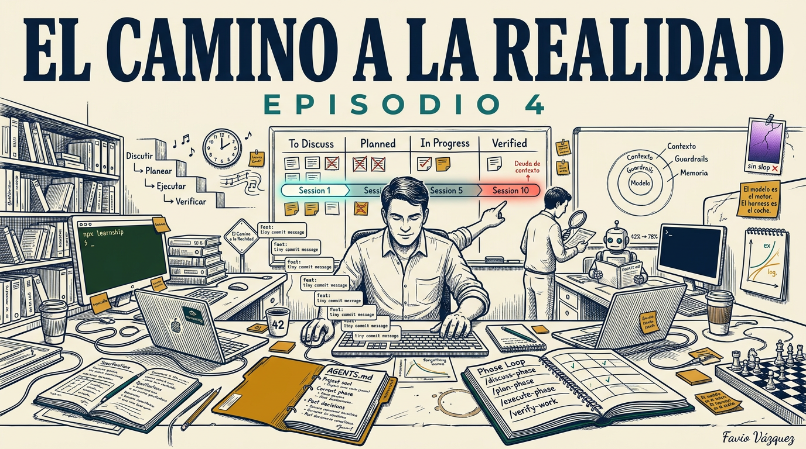

---

En el episodio 3 hice una promesa. Describí la ingeniería agéntica como un sistema, no como un estilo de uso. Expliqué los cuatro pilares: arquitectura de contexto, especialización de agentes, memoria persistente, ejecución estructurada. Presenté `learnship` como mi implementación concreta de ese sistema. Y al final, en las últimas líneas, dije: la versión 1.5.3 está disponible ahora, se instala en 30 segundos.

Muchos la instalaron. Muchos me escribieron. Y la pregunta más común no fue "¿cómo funciona?" sino algo más honesta: **"¿cómo empiezo?"**

Este episodio es la respuesta. No la descripción del sistema. El uso del sistema.

Vamos a construir un proyecto real, paso a paso, desde la primera línea de conversación hasta el código en producción, usando `learnship` como el andamiaje que lo sostiene todo. Verás exactamente qué escribir, qué esperar, qué decidir, y qué hace el agente mientras tú te concentras en las partes que genuinamente requieren tu criterio.

Pero antes de llegar ahí, necesito explicar algo que el episodio 3 dejó sin resolver: por qué la mayoría de los proyectos con IA se rompen exactamente en el momento en que deberían estar funcionando.

---

## El muro del proyecto mediano

Hay un patrón que todos los que han trabajado seriamente con IA en proyectos de código han experimentado, aunque no siempre lo nombren así.

La sesión 1 es extraordinaria. El agente parece entender todo. El código aparece limpio, bien estructurado, con comentarios sensatos. Terminas la sesión con la sensación de que algo cambió, de que la productividad se multiplicó.

La sesión 5 empieza a sentirse diferente. Tienes que re-explicar algunas cosas que ya discutiste. El agente genera código que funciona en aislamiento pero que ignora una convención que estableciste en la sesión 2. Corriges. Sigues.

La sesión 10 es frustrante. El contexto de lo que construiste hasta ahora es demasiado grande para explicarlo de nuevo. Las decisiones que tomaste están enterradas en conversaciones pasadas que nadie puede recuperar. El agente genera algo correcto en abstracto pero incorrecto para *tu* proyecto en *este* momento. Y empieza a aparecer lo que en el episodio 3 llamé **deuda de contexto**: el costo acumulado de empezar cada sesión desde cero.

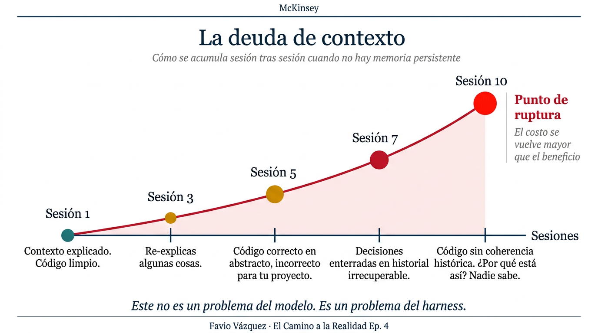

Este no es un problema del modelo. GPT-4o, Claude Sonnet, Gemini 2.5 Pro: todos tienen el mismo problema. La arquitectura de los modelos de lenguaje resetea el contexto cuando la sesión se cierra. Eso no va a cambiar con el próximo lanzamiento.

Es un problema de harness. Y `learnship` es la respuesta a ese problema específico.

---

## Lo que aprendí construyendo con agentes en proyectos reales

Antes de mostrarte cómo funciona `learnship`, quiero ser honesto sobre cómo llegué a construirlo.

En el episodio 2, construí `agentic-learn`: un skill para que el agente esperara tu respuesta antes de darte la suya. La idea era preservar la fricción productiva que hace que el aprendizaje sea real. La respuesta fue buena. Muchas personas lo instalaron, lo usaron, encontraron valor en él.

Pero algo me quedó pendiente, y lo dije explícitamente en el episodio 3: `agentic-learn` resolvía el aprendizaje. No resolvía el workflow. No resolvía la memoria persistente. No resolvía la documentación que se desactualiza. No resolvía el agente que no recuerda lo que decidiste la semana pasada.

Así que me puse a construir `learnship`. Y mientras lo construía, usando `learnship` para construir `learnship`, entendí algo que no estaba en ninguno de los artículos que leí:

**El problema más costoso no es que el agente no sepa. Es que el agente no sabe lo que no sabe.**

Un agente sin contexto persistente no te dice "no sé la arquitectura de tu proyecto". Te genera código que asume una arquitectura plausible. Ese código compila. Pasa los tests unitarios básicos. Se ve bien. Y se rompe dos semanas después cuando otro agente, en otra sesión, genera código que asume una arquitectura diferente, igualmente plausible.

El costo no es inmediato. Es diferido. Y eso lo hace especialmente peligroso.

---

## La investigación que cambió cómo pienso sobre harnesses

Antes de entrar en cómo usar `learnship`, quiero mostrarte por qué el harness importa más que el modelo, con datos concretos.

En la investigación que respaldó las decisiones de diseño de `learnship`, encontré tres números que se quedaron conmigo:

**42% vs. 78%.** El mismo modelo de base, el mismo benchmark, dos scaffolds diferentes. El scaffold correcto casi dobla el performance del modelo. La fuente: investigación sobre architecturas de agentes publicada en 2024. El modelo era idéntico. El único variable era el harness.

**47%.** La reducción en uso de tokens que Cursor logró implementando *lazy context loading*, la idea de que el agente no debería ver todo el contexto de un proyecto en cada llamada, sino solo el contexto relevante para la tarea actual. No un modelo mejor. Una estrategia de entrega de contexto más inteligente.

**80%.** El porcentaje de herramientas que Vercel eliminó de su agente antes de ver que completaba tareas que antes fallaba. Menos herramientas, más foco, mejor performance. Mismo modelo. El único cambio fue acotar el scope.

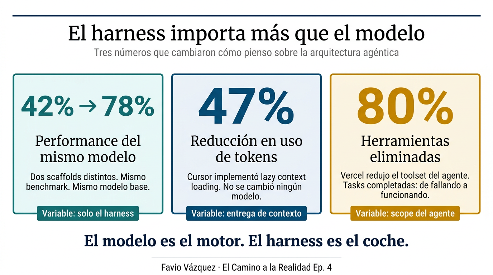

Estos tres números apuntan a lo mismo: **la arquitectura que rodea al modelo determina más el resultado que el modelo en sí**. El modelo es el motor. El harness es el coche. Nadie evalúa un coche solo por su motor.

`learnship` es el coche.

---

## Qué es learnship, con precisión

`learnship` es un harness de agente portátil y de código abierto que se instala dentro de tu herramienta de IA existente y le agrega tres cosas que tu agente no tiene por defecto:

**Memoria persistente.** Un archivo `AGENTS.md` que se carga en cada sesión para que el agente siempre conozca el proyecto, la fase actual, el stack técnico y las decisiones pasadas. Sin re-explicaciones. Sin deuda de contexto.

**Proceso estructurado.** Un Phase Loop repetible (Discuss → Plan → Execute → Verify) con planes spec-driven, ejecución wave-ordenada y verificación UAT-driven. El harness controla qué contexto llega al agente en cada paso.

**Aprendizaje integrado.** Checkpoints respaldados por neurociencia en cada transición de fase para que entiendas lo que enviaste a producción, no solo que lo enviaste.

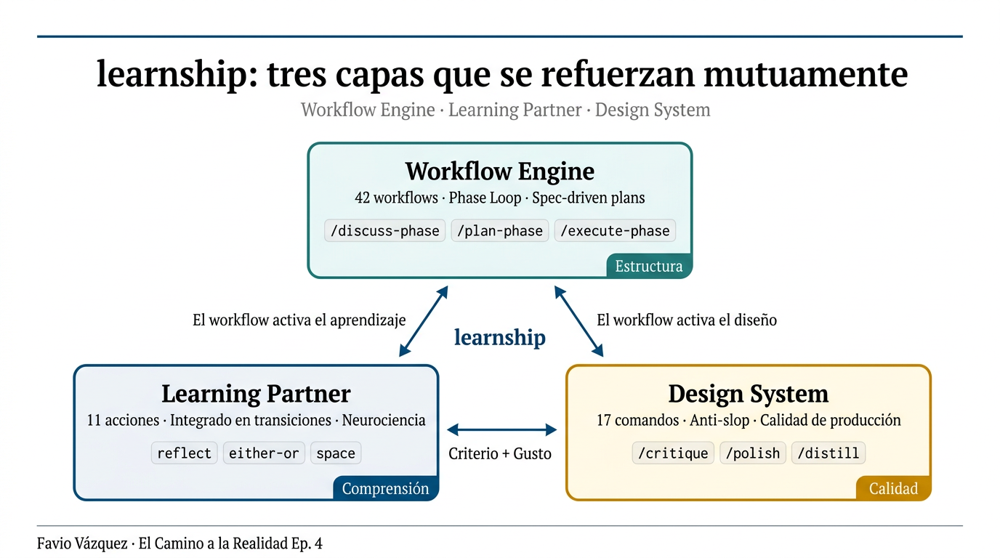

Lo que hace diferente a `learnship` no es ninguna de estas tres cosas por separado. Es que están integradas. El workflow activa el aprendizaje. El aprendizaje refina el criterio. El criterio mejora el workflow. No son módulos opcionales. Son tres aspectos del mismo sistema, diseñados para reforzarse mutuamente.

---

## Instalar learnship en 30 segundos

Antes de ir al proyecto de ejemplo, la instalación. Una línea:

```bash
npx learnship
```

El instalador auto-detecta tu plataforma. Si quieres instalarlo en todas las plataformas CLI de una vez:

```bash
npx learnship --all --global
```

`learnship` funciona en seis plataformas: **Windsurf**, **Claude Code**, **Cursor**, **OpenCode**, **Gemini CLI**, **Codex CLI**.

Una vez instalado, abre tu agente y escribe:

```
/ls
```

Eso es todo. `/ls` te dice dónde estás, qué sigue, y ofrece ejecutarlo. Si no hay proyecto activo todavía, te ofrece iniciar uno.

---

## Los cinco comandos que necesitas saber

`learnship` tiene 42 workflows. No necesitas conocerlos todos para empezar. Estos cinco cubren el 90% del trabajo:

| Comando | Cuándo usarlo |
|---|---|
| `/ls` | **Inicio de cada sesión.** Muestra estado, ofrece ejecutar el siguiente paso. |
| `/new-project` | Inicio de un proyecto nuevo desde cero. |
| `/quick "..."` | Fix pequeño, experimento, tarea ad-hoc sin el Phase Loop completo. |
| `/next` | Autopilot. Cuando quieres seguir sin decidir qué hacer. |
| `/help` | Los 42 workflows organizados por categoría. |

El resto aparece naturalmente desde `/ls`: el sistema te dice cuál workflow es el siguiente según el estado actual del proyecto.

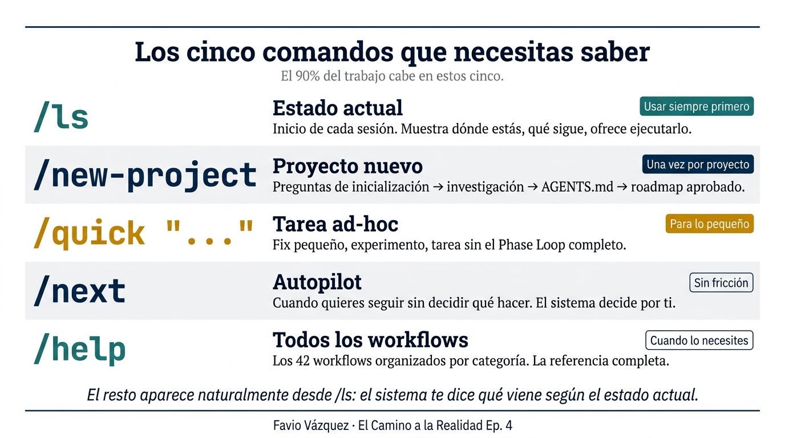

---

## El Phase Loop: la estructura que lo sostiene todo

El corazón de `learnship` es el Phase Loop. Cuatro pasos que se repiten para cada fase del proyecto:

```
/discuss-phase → /plan-phase → /execute-phase → /verify-work
```

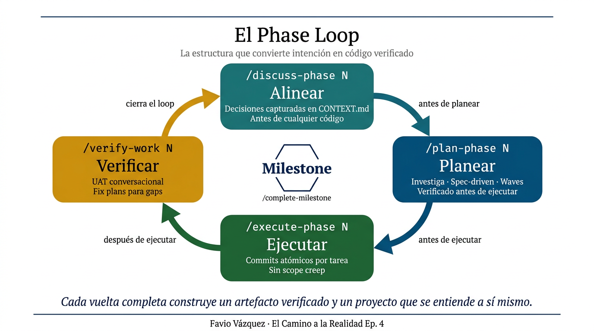

Cada paso tiene un propósito específico y un output concreto. No es burocracia. Es el "paso atrás del pintor" que describí en el episodio 3: el momento de ver el lienzo completo antes de seguir pintando, institucionalizado como parte del ritmo de trabajo.

---

## El proyecto de ejemplo

El proyecto de ejemplo no es un proyecto de ejemplo. Es un sitio estático de educación científica que lleva meses en construcción, con 50 paradas interactivas que cubren la historia de la física desde Thales de Mileto hasta los agujeros negros y la computación cuántica. Se llama "How Physics Works" y vive en `Episodio4/` dentro del mismo repositorio donde estás leyendo este artículo — literalmente: la carpeta que contiene este artículo también contiene el sitio que describe.

Lo elegí porque es el tipo de proyecto donde el Phase Loop demuestra su valor o queda expuesto como ceremonia. No es un script de 50 líneas. No es un prototipo desechable. Tiene catorce fases planificadas, cincuenta páginas HTML individuales, física simulada en canvas 2D con integradores numéricos reales, una búsqueda con fuzzy matching, ecuaciones matemáticas renderizadas en KaTeX, y un lector que eventualmente va a llegar a la parada 050 esperando que todo funcione. **Es el tipo de proyecto donde la coherencia a través del tiempo importa de verdad.**

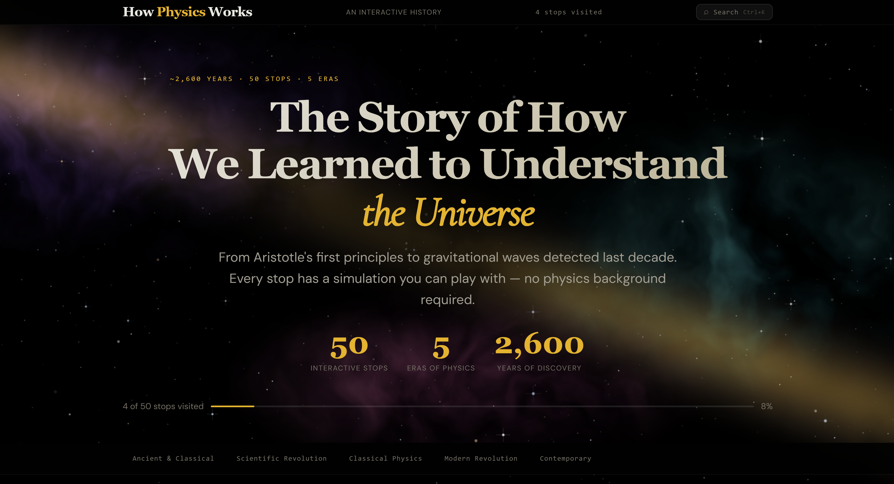

---

La primera decisión del proyecto no fue sobre física. Fue sobre dónde vivía el código. El mismo repositorio, `roadtoreality/`, alberga artículos de episodios anteriores y va a albergar proyectos futuros. Poner todo el código del sitio en la raíz hubiera contaminado esa estructura. La decisión que se registró como `DEC-001` fue directa: todo el código generado — HTML, CSS, JS, fuentes, datos — vive bajo `Episodio4/`. Los artefactos de planning viven bajo `.planning/`. Sin excepciones. Eso puede parecer trivial hasta que llegas a la fase 06 y hay un agente nuevo que necesita configurar GitHub Pages para servir desde el subdirectorio correcto. `DEC-001` le dice exactamente qué hacer antes de que pregunte.

La segunda decisión del proyecto fue sobre el build pipeline. La pregunta que surgió en el primer `/discuss-phase` fue simple: ¿Vite? ¿Eleventy? ¿Webpack? La respuesta fue no a los tres, y esa negación se guardó en `DEC-002`: puro HTML, CSS y JavaScript sin transpiladores, sin bundlers, sin pasos de build. Vite añade complejidad. Eleventy es innecesario para páginas HTML estáticas. El sitio tiene que funcionar con `python3 -m http.server` desde el directorio `Episodio4/` sin preprocessing. Eso es suficiente. Sin `DEC-002`, cada agente que llegue después tiene la tentación completamente razonable de proponer modernizar el toolchain mientras trabaja en otra cosa. Esa propuesta no es incorrecta en abstracto. Es incorrecta para *este* proyecto, por razones que ahora están documentadas. `DEC-002` descarta la conversación antes de que empiece.

---

La fase 02 estableció la decisión que más consecuencias tuvo: `stops.json` como única fuente de verdad para las 50 paradas. Toda la metadata — nombre del científico, período histórico, era, descripción, si está implementado o es stub — vive en un solo archivo. `nav.js` lo lee para renderizar la grilla. Cada página de parada tiene un JSON script tag que espeja los campos relevantes. Con eso en su lugar, agregar la parada 051 en el futuro requiere un solo cambio en un solo archivo. Sin eso, son cincuenta actualizaciones coordinadas esperando a desincronizarse.

Las fases 03 y 04 construyeron las simulaciones de las Eras 1 y 2: Thales, Demócrito, Aristóteles, Arquímedes, Eratóstenes, Ptolomeo, Copérnico, Galileo, Kepler, Newton. Doce simulaciones interactivas en canvas 2D, más la decimotercera que vino después. La decisión que definió esas fases fue `DEC-006`: integradores Runge-Kutta de cuarto orden para mecánica orbital y péndulos, Euler para simulaciones simples de corta duración. Eso no es obvio mirando el código. Un agente que llegue al archivo `sim.js` del péndulo de Galileo y vea RK4 podría perfectamente asumir que es over-engineering y proponerse simplificarlo. `DEC-006` explica por qué eso sería un error: los sistemas que orbitan pierden energía con Euler, y esa pérdida hace que las órbitas espiralen hacia adentro en lugar de mantenerse estables. La cañón de Newton que se convierte en satélite en la parada 013 no puede funcionar con Euler — la órbita colapsaría en segundos de simulación.

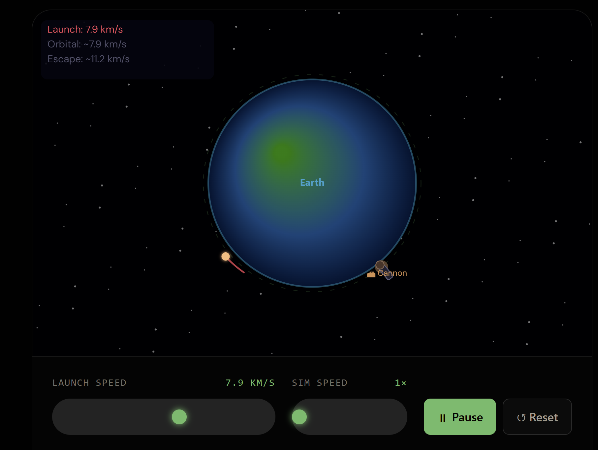

La fase 01 también estableció algo menos técnico pero igualmente importante: la estética del sitio. El brief fue explícito — más pulido que el sitio de referencia, oscuro, elegante, lujoso. Eso llevó a una decisión que quedó como `DEC-010`: el fondo de galaxia de la landing page usa ruido Perlin fBm renderizado píxel por píxel en un canvas offscreen a cuarta resolución, luego escalado. El enfoque inicial fue gradientes radiales apilados — producían blobs de color suaves sin estructura interna. Las nebulosas reales tienen estructura filamentaria, vacíos oscuros, polvo. Eso requiere evaluación de funciones de ruido por píxel, no primitivas de gradiente. **`DECISIONS.md` no es un registro de lo que construiste. Es un registro de lo que decidiste no construir, y por qué. Esa es la parte que las ventanas de contexto olvidan.**

---

La fase 05 desplegó el sitio. GitHub Pages, servido desde el subdirectorio `Episodio4/`, exactamente como especificaba `DEC-001`. El v1.0 quedó en línea con 13 simulaciones interactivas completas y 37 páginas stub listas para las fases siguientes.

La fase 06 añadió KaTeX para ecuaciones matemáticas en todas las paradas, Fuse.js para búsqueda con fuzzy matching por `Cmd+K` / `Ctrl+K`, polish de UX global — altura de viewport en móvil, navegación por teclado con las flechas ←→ entre paradas — y 37 páginas stub con animaciones de teaser animadas en canvas, una por concepto físico. No placeholders en gris. Cada stub es una página completa que hace querer ver la implementación real.

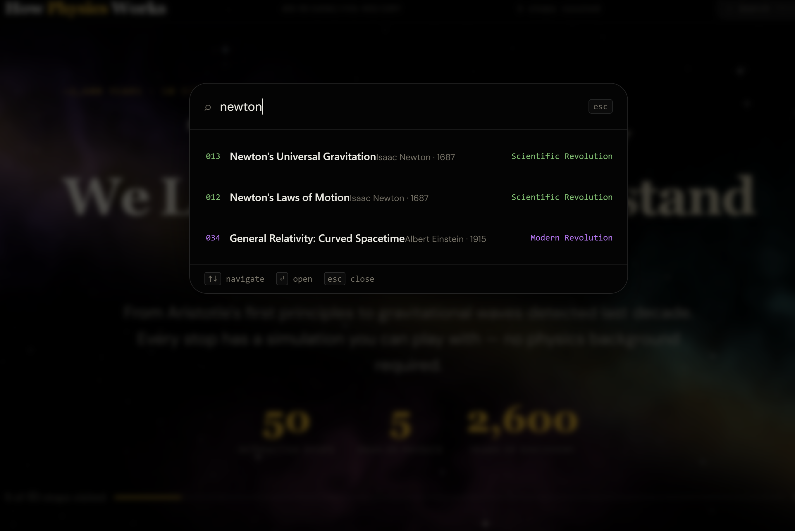

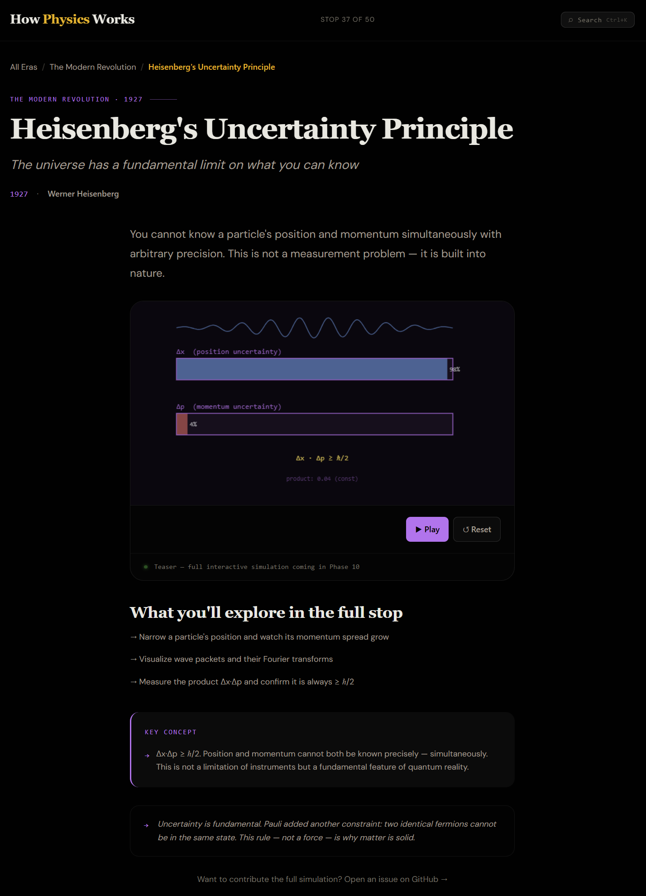

El `/verify-work` de la fase 06 cubrió 12 tests. Diez pasaron sin problemas. Tres fallaron de formas que vale la pena describir con precisión porque ilustran exactamente para qué sirve un UAT conversacional cuando está bien hecho.

El primer problema fue la parada 027, Max Planck. El loop de `requestAnimationFrame` estaba activo, la función de dibujo se llamaba 60 veces por segundo, el código era correcto. Pero la animación parecía estática. No era un bug de código: era un problema de diseño. La variación de opacidad del resplandor era ±0.2 — imperceptible para un observador que no sabe que algo debería moverse. El diagnóstico del UAT fue preciso: reemplazar con movimiento claramente dinámico, construcción progresiva de la curva de cuerpo negro, pico pulsante, barrido de temperatura. Eso es lo que permitió escribir un fix plan quirúrgico en lugar de una instrucción vaga.

El segundo problema fue la parada 040, fisión nuclear. La reacción en cadena funcionaba, los núcleos se partían, los neutrones viajaban. Pero la reacción completa ocurría en milisegundos. La causa raíz era geométrica: los núcleos hijos se spawneaban a 16 píxeles del padre (`dist = nuc.r × 0.8`), y los neutrones viajaban a 2.5 píxeles por frame. A esa velocidad, un neutrón alcanza el núcleo hijo en aproximadamente seis frames — menos de una décima de segundo. El fix plan fue específico: aumentar la distancia de spawn, reducir la velocidad de los neutrones, añadir un delay timer por núcleo antes de que se vuelva alcanzable. La diferencia entre esa instrucción y "hacer la animación más lenta" es la diferencia entre un fix que cualquier agente puede ejecutar correctamente y uno que va a producir algo diferente cada vez.

El tercer problema era de descubribilidad: la búsqueda funcionaba, pero no había ningún affordance visual en ninguna de las 51 páginas del sitio. Un usuario nuevo no tenía forma de saber que existía. El fix fue añadir un botón de búsqueda en el header de cada página, con el hint de teclado correcto según plataforma — `⌘K` en Mac, `Ctrl+K` en los demás. Cincuenta y un archivos HTML, modificados en batch. El issue de UAT convirtió eso en una tarea con scope definido.

---

Cabe señalar algo sobre cómo se usó `learnship` en este proyecto: las fases 01 a 04 ejecutaron `/plan-phase` y `/execute-phase` directamente, y el `/discuss-phase` para esas fases se corrió de forma retroactiva, después de la ejecución, para capturar las decisiones que ya se habían tomado. Eso no es la secuencia ideal. Es la secuencia real de un proyecto que avanzó rápido al principio. Y funciona: el sistema es lo suficientemente flexible para absorber trabajo existente sin requerir un comienzo limpio. El artefacto que produce `/discuss-phase` tiene valor independientemente de si precede o sigue a la ejecución.

El directorio `.planning/` al terminar la fase 06 se veía así:

```
.planning/
├── config.json
├── PROJECT.md
├── REQUIREMENTS.md
├── ROADMAP.md
├── STATE.md
├── DECISIONS.md
└── phases/
    ├── 01-foundation-shell/
    ├── 02-stops-data-navigation/
    ├── 03-era1-simulations/
    ├── 04-era2-simulations/
    ├── 05-polish-deployment/
    ├── 06-v2-foundation-ux-polish/
    ├── 06.1-episodio4-article-learnship/
    ├── 07-v2-open-graph/
    └── 08-v2-era-gap-fills/
```

Cada directorio de fase contiene su `CONTEXT.md`, su `RESEARCH.md`, sus archivos `PLAN.md` ejecutados, sus `SUMMARY.md` de lo que se construyó exactamente, y su `UAT.md` con los resultados de verificación. No es overhead. Es el registro de todo lo que el proyecto aprendió sobre sí mismo: qué se construyó, por qué, qué alternativas se consideraron, qué bugs se resolvieron y cómo. Es el scar tissue digital que no puede descargarse de ningún modelo pero sí puede acumularse de forma deliberada.

---

La fase 07 fue la más mecanizable del proyecto hasta ahora. El objetivo era claro: cada una de las 50 paradas necesitaba una imagen de Open Graph para previews sociales. La implementación fue un script ESM en Node.js — `scripts/generate-og-svgs.mjs` — que lee `stops.json` y genera un SVG de 1200×630 por parada, usando el color de acento de cada era como barra lateral izquierda, el nombre del científico en tipografía grande, el año como badge. Cincuenta archivos. Un script. Una decisión que valió la pena documentar: los colores oklch del design system no funcionan en SVG, que requiere hex. La conversión quedó fijada en el script — `ancient=#c4922a, revolution=#4ca86b, classical=#5b8fd4` — y si el design system cambia de paleta, el script es la única fuente de verdad a actualizar. Después, `scripts/inject-og-meta.mjs` recorrió los 50 HTMLs e inyectó `og:title`, `og:description`, `og:image` y `twitter:card`. El resultado: cualquier parada del sitio pegada en LinkedIn o Twitter produce un preview visual coherente con la estética del sitio.

La fase 08 cerró los dos huecos que habían quedado en las Eras 1 y 2. La parada 002 — Pitágoras y la armonía matemática — y la parada 014 — la ley de Hooke y la elasticidad — eran las únicas dos que seguían como stubs después de que las fases 03 y 04 construyeron el resto.

La parada 002 fue técnicamente interesante por un detalle que no aparece en la descripción: Web Audio API en iOS requiere que el `AudioContext` se cree en respuesta a un gesto del usuario, no al cargar la página. La primera implementación creaba el contexto en la inicialización del sim — correcto en escritorio, silencioso en iOS sin error visible. La solución fue lazy initialization: el `AudioContext` se crea la primera vez que el usuario hace clic en un botón de ratio, no antes. Después de eso, los seis botones (1:1 hasta 9:8) producen tonos sine puros y animan la visualización de la onda estacionaria en canvas — `A · sin(nπ(x - x₀) / L) · cos(ωt)` — con los nodos marcados como puntos en los cruces por cero.

La parada 014 usó el mismo patrón de canvas dividido que las paradas 010 y 012: el panel izquierdo muestra el resorte con el bloque colgando, el panel derecho muestra la gráfica F vs. x en tiempo real. La física es simple de forma deliberada — una fracción del slider lineal mapeada a fuerza y extensión, sin ODE — porque el objetivo pedagógico es mostrar la relación F = -kx, no simular un resorte con masa. Lo no obvio fue el modo de ruptura: cuando el slider supera el límite elástico, el resorte entra en zona plástica y eventualmente se rompe. La animación de ruptura fue específica: 18 frames de canvas shake — `ctx.save()` / `ctx.translate(offsetX, offsetY)` / `ctx.restore()` — con un overlay rojo que se desvanece con el timer. Tres presets de material (acero k=500, goma k=50, vidrio k=800) demuestran que la forma de la curva F vs. x es la misma en todos los casos, pero la escala cambia.

**Al terminar la fase 08, las Eras 1 y 2 están completas: 14 simulaciones interactivas, todas con OG images, todas indexadas en `stops.json`, todas navegables con las flechas ←→ del teclado.**

El paso a paso exacto de cómo se ve cada uno de estos momentos en la práctica es lo que viene a continuación.

---

## Paso a paso: cómo se ve en la práctica

Aunque el ejemplo completo viene en la versión final, quiero darte la estructura exacta de lo que pasa en cada paso del Phase Loop. Esta es la secuencia real.

### Paso 0: `/ls`

Cada sesión empieza con `/ls`. Sin excepción.

```
/ls
```

Si hay un proyecto activo, la respuesta se ve así:

```
📍 Estado actual
   Proyecto: [nombre del proyecto]
   Fase actual: Fase 2 — [nombre de la fase]
   Último paso completado: /execute-phase 1 ✓
   Próximo paso: /verify-work 1

¿Ejecuto /verify-work 1 ahora?
```

Si no hay proyecto, el agente ofrece crear uno:

```
No hay proyecto activo. ¿Quieres empezar uno nuevo?
Ejecuta /new-project cuando estés listo.
```

### Paso 1: `/new-project`

`/new-project` no es un formulario. Es una conversación. El agente hace preguntas estructuradas:

- ¿Qué estás construyendo?
- ¿Qué problema resuelve?
- ¿Cuál es tu stack técnico preferido (o "ayúdame a decidir")?
- ¿En qué plataforma o entorno va a correr?

Después de tus respuestas, el agente:

1. Investiga el dominio: ecosistema, mejores prácticas, trampas comunes, opciones arquitectónicas
2. Escribe los artefactos del proyecto: `AGENTS.md`, `.planning/PROJECT.md`, `.planning/REQUIREMENTS.md`
3. Propone un roadmap: una lista de fases con descripciones

Revisas el roadmap. Si algo no encaja, le dices al agente que ajuste antes de aprobarlo.

El resultado del directorio después de `/new-project`:

```
.planning/
├── config.json
├── PROJECT.md       ← qué estás construyendo
├── REQUIREMENTS.md  ← REQ-001 … REQ-N
├── ROADMAP.md       ← fases con status
└── STATE.md         ← posición actual

AGENTS.md            ← el agente lee esto en cada sesión
```

`AGENTS.md` es el artefacto más importante del sistema. Es la memoria que sobrevive el reset. Cada vez que el agente inicia una nueva sesión, lee `AGENTS.md` primero. Ahí están los principios del proyecto, la fase actual, el stack técnico, las convenciones, los bugs ya resueltos. No hay re-explicación. No hay deuda de contexto.

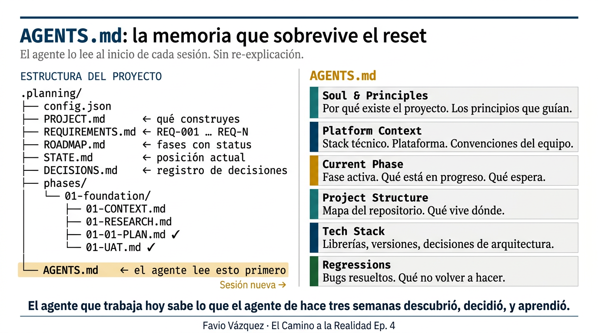

### Paso 2: `/discuss-phase 1`

`/discuss-phase` es una conversación de alineación antes de planear. El agente lee `AGENTS.md` y tu roadmap, y hace preguntas sobre preferencias de implementación para esta fase específica:

- ¿Qué bibliotecas prefieres para la capa de autenticación?
- ¿Las migraciones de base de datos deben ser code-first o SQL-first?
- ¿Hay algún patrón existente que seguir para el manejo de errores?

Tus respuestas se escriben en `.planning/phases/01-*/01-CONTEXT.md`: un archivo persistente que el planner lee antes de crear cualquier plan. El planner nunca contradice una decisión activa guardada aquí.

Este es el "escribir antes de construir" del episodio 3, en forma de workflow. No es un documento que nadie lee. Es un artefacto que el sistema consume directamente.

### Paso 3: `/plan-phase 1`

El planner:
1. Lee tu `CONTEXT.md` y todas las decisiones anteriores
2. Investiga el dominio técnico específico para esta fase
3. Crea 2-4 archivos `PLAN.md` ejecutables, cada uno acotado a un área
4. Corre un loop de verificación (hasta 3 pasadas) para verificar que los planes son coherentes entre sí

Cada plan describe tareas concretas con suficiente detalle para que un agente ejecutor pueda implementarlas sin adivinar. Las tareas se organizan en *waves*: tareas independientes en la misma wave, tareas dependientes en waves posteriores.

En plataformas que soportan paralelización real (Claude Code, OpenCode, Codex CLI), las tareas de una misma wave pueden ejecutarse con agentes dedicados en paralelo, cada uno con su propio contexto de 200k tokens.

El output del directorio después de `/plan-phase 1`:

```
.planning/phases/01-foundation/
├── 01-CONTEXT.md    ← tus preferencias (de /discuss-phase)
├── 01-RESEARCH.md   ← investigación de dominio
├── 01-01-PLAN.md    ← plan wave 1
└── 01-02-PLAN.md    ← plan wave 2
```

### Paso 4: `/execute-phase 1`

La ejecución corre wave por wave. Cada tarea recibe un commit atómico. El executor no improvisa, no agrega scope, no toma decisiones que no estaban en el plan. Si descubre algo que cambia el plan (el API no soporta lo que el spec asumía, hay un patrón existente mejor), documenta el cambio en `SUMMARY.md` y reporta.

Este es el guardrail de ejecución del harness: el agente hace exactamente lo que el plan dice, y nada más. El scope creep — la tendencia del agente a "mejorar" cosas que no estaban en el plan — está estructuralmente prevenido.

```
.planning/phases/01-foundation/
├── 01-CONTEXT.md
├── 01-RESEARCH.md
├── 01-01-PLAN.md     ← ejecutado
├── 01-01-SUMMARY.md  ← qué se construyó exactamente
├── 01-02-PLAN.md     ← ejecutado
├── 01-02-SUMMARY.md
└── 01-UAT.md         ← pendiente (lo genera /verify-work)
```

### Paso 5: `/verify-work 1`

UAT conversacional. El agente presenta qué *debería* ocurrir en cada deliverable. Tú confirmas si la realidad coincide:

1. El agente muestra qué se construyó y los criterios de aceptación
2. Tú pruebas: corres la app, pruebas los endpoints, verificas el comportamiento
3. Reportas cualquier problema: *"El endpoint /login devuelve 500 cuando falta el email"*
4. El agente diagnostica causa raíz y crea fix plans específicos
5. Ejecutas los fixes, luego re-verificas

Cuando todo pasa: `✓ Fase 1 completa`.

No hay "listo" sin verificación. No hay merge sin que alguien confirmó que el output hace lo que debería hacer.

---

## DECISIONS.md: el registro de por qué

Uno de los problemas más comunes en proyectos que duran más de unas semanas es lo que llamo "arqueología de decisiones": alguien llega a un fragmento de código, ve una elección que parece arbitraria o incluso incorrecta, y no hay forma de saber si fue una decisión consciente con una razón válida o simplemente un error que nadie corrigió.

En el episodio 3 describí esto como la documentación que siempre se desactualiza. La novedad de `learnship` es que el agente es co-mantenedor de esa documentación, no solo los humanos.

`.planning/DECISIONS.md` tiene este formato:

```markdown
## DEC-001: Usar polling en lugar de notificaciones en tiempo real
Date: 2026-03-01 | Phase: 2 | Type: arquitectura
Context: El sistema de alertas necesita mostrar actualizaciones al usuario
Options:
  - WebSockets (tiempo real, conexión persistente, mayor costo de infraestructura)
  - Polling cada 30 segundos (más simple, suficiente para nuestro caso de uso)
Choice: Polling cada 30 segundos
Rationale: Los usuarios no necesitan actualizaciones al milisegundo;
           el costo de mantener conexiones abiertas no justifica el beneficio real
Consequences: Si en el futuro necesitamos tiempo real, habrá que migrar esa capa
Status: active
```

El planner lee este archivo antes de escribir cualquier plan. Las decisiones activas son no-negociables: el agente implementa respetando la decisión, no la contradice. Si el agente detecta que una decisión activa ya no es válida (el API no soporta lo que el spec asumía), lo documenta y reporta en lugar de silenciosamente ignorarla.

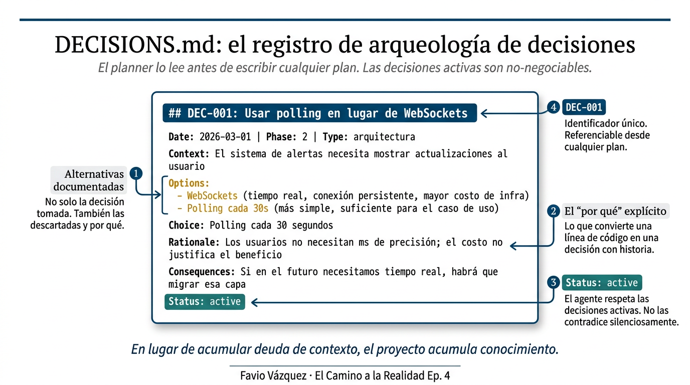

El resultado: en lugar de acumular deuda de contexto, el proyecto acumula conocimiento. Cada decisión tiene contexto, opciones consideradas, rationale, consecuencias. Ese registro es el activo más valioso del sistema.

---

## El aprendizaje integrado en el workflow

En `agentic-learn` (episodio 2), las acciones de aprendizaje eran algo que tenías que recordar invocar. Podías estar en el medio de una sesión de trabajo y acordarte de `@agentic-learning reflect`. O no.

En `learnship`, el Learning Partner está integrado en los puntos naturales de transición del workflow. No tienes que recordar invocarlo. El sistema te lo ofrece en el momento correcto, cuando la tarea recién completada está fresca en la memoria de trabajo.

| Después de | Acción de aprendizaje | Qué hace |
|---|---|---|
| `/new-project` aprobado | `brainstorm` | Diálogo de diseño colaborativo antes de una línea de código |
| `/discuss-phase` | `either-or` | Registro de decisión: caminos considerados, elección, rationale |
| `/plan-phase` | `cognitive-load` | Descompone scope abrumador en pasos del tamaño de la memoria de trabajo |
| `/execute-phase` | `reflect` | Tres preguntas: ¿qué decidiste? ¿qué intentabas lograr? ¿qué sigue siendo fuzzy? |
| `/verify-work` pasa | `space` | Programa conceptos para revisita espaciada, escribe `docs/revisit.md` |

El principio que atraviesa todas las acciones es el mismo que construí en `agentic-learn`: **el agente espera tu respuesta antes de dar la suya**. La inversión del orden es lo que convierte una herramienta de respuesta rápida en una herramienta de construcción de criterio real.

---

## La suite impeccable: calidad de diseño sin negociar

La tercera capa de `learnship` es la suite **impeccable**, basada en el trabajo de `@pbakaus`. 17 comandos de steering que previenen la estética genérica de IA antes de que aparezca.

En el episodio 3 hablé del *slop*: el output genérico de IA que la persona promedio puede sentir aunque no pueda nombrarlo. El gradiente púrpura. La animación sin propósito. La tipografía que nadie eligió conscientemente. Raphael Salaja lo articuló mejor que nadie: *"La persona promedio puede sentir la falta de elementos humanos."*

La suite impeccable es la respuesta sistémica a ese problema. Está activa como contexto permanente para cualquier trabajo de UI: el agente lee los principios de diseño y los aplica por defecto.

Algunos comandos:

- `/critique` — Crítica honesta de UX antes del polish. Encuentra exactamente qué está mal.
- `/polish` — Pase final de calidad antes del merge.
- `/animate` — Animaciones con propósito, no decoración.
- `/distill` — Eliminar complejidad, clarificar qué importa.
- `/bolder` — Amplificar diseños seguros o aburridos.
- `/quieter` — Reducir intensidad, ganar refinamiento.

El **AI Slop Test** integrado en `/critique`:

> *"Si le mostraras esta interfaz a alguien y dijeras 'la hizo IA', ¿lo creería de inmediato?"*

Si la respuesta es sí: ese es el problema. `/critique` encuentra exactamente dónde.

---

## El ciclo completo en un vistazo

Antes de ir al ejemplo concreto, quiero mostrarte el ciclo completo de un proyecto `learnship` en un solo diagrama:

```
npx learnship
     ↓
/new-project
→ Preguntas de inicialización
→ Investigación de dominio
→ AGENTS.md + .planning/ creados
→ Roadmap propuesto y aprobado
     ↓
Para cada fase:
/discuss-phase N   → Decisiones capturadas en CONTEXT.md
/plan-phase N      → Planes spec-driven, verificados, en waves
/execute-phase N   → Commits atómicos, sin scope creep
/verify-work N     → UAT conversacional, fix plans para gaps
     ↓
Cuando todas las fases están completas:
/audit-milestone   → Coverage de requisitos, detección de stubs
/plan-milestone-gaps → Si hay gaps, crear fases de fix
/complete-milestone → Archive, tag, preparar próximo milestone
```

El directorio `.planning/` al final de un milestone completo:

```
.planning/
├── config.json
├── PROJECT.md
├── REQUIREMENTS.md
├── ROADMAP.md        ← todas las fases ✓
├── STATE.md          ← milestone completado
├── DECISIONS.md      ← registro completo de decisiones
└── phases/
    ├── 01-foundation/ ← ejecutado y verificado
    ├── 02-auth/       ← ejecutado y verificado
    ├── 03-api/        ← ejecutado y verificado
    └── 04-ui/         ← ejecutado y verificado

AGENTS.md             ← historia completa del proyecto
```

Ese directorio `.planning/` no es overhead. Es el registro de todo lo que el proyecto aprendió sobre sí mismo: qué se construyó, por qué, qué alternativas se consideraron, qué bugs se resolvieron. Es el scar tissue digital del proyecto.

---

## Lo que esto no es — honestidad sobre los límites

Quiero ser preciso sobre lo que `learnship` hace y lo que no hace, porque la overpromise es el problema número uno de las herramientas de IA.

**`learnship` no te hace un mejor ingeniero automáticamente.** Te da la estructura para que las cosas que te harían mejor ingeniero —escribir specs, documentar decisiones, reflexionar después de ejecutar— ocurran de forma consistente en lugar de cuando te acuerdas.

**`learnship` no reemplaza el criterio.** Amplifica el criterio que ya tienes. Si no tienes criterio sobre qué construir o cómo evaluarlo, el sistema te da una estructura vacía. El valor viene de la intersección entre la estructura y el criterio que traes tú.

**`learnship` no es para todos los proyectos.** Para un script de 50 líneas o un experimento de un día, la ceremonia del Phase Loop es overhead innecesario. `/quick` existe exactamente para eso. La estructura completa está diseñada para proyectos donde la coherencia a través del tiempo importa.

**`learnship` no garantiza que no vas a construir la cosa equivocada.** El sistema puede ejecutar perfectamente un plan incorrecto. La decisión de qué vale la pena construir, esa es tuya. Siempre.

---

## La conexión con los tres episodios anteriores

Hay un hilo que conecta los cuatro episodios de esta investigación, y quiero hacerlo explícito porque no es obvio si los lees por separado.

**Episodio 1** planteó la pregunta central: la IA es poderosa, pero la realidad tiene sus propias fricciones. El conocimiento que se gana a golpes —el *scar tissue*, el tejido cicatricial— no puede descargarse de un modelo. La velocidad del aprendizaje en sistemas complejos está acotada por la velocidad de la realidad, no por la velocidad del cómputo.

**Episodio 2** exploró el problema del aprendizaje pasivo: usar IA para obtener output sin construir comprensión. Construí `agentic-learn` como una capa que invierte el orden: el agente espera tu respuesta antes de dar la suya. La fricción productiva como mecanismo de aprendizaje real. Lo que no dije explícitamente en ese episodio es que ese skill específico — el agente que espera, que no da su respuesta hasta que el humano ha procesado la suya — sigue siendo la columna vertebral del Learning Partner en `learnship`. Los checkpoints de aprendizaje integrados en el workflow no son una idea nueva. Son `agentic-learn` promovido de skill independiente a paso estructurado dentro del Phase Loop.

**Episodio 3** amplió el problema. No era solo cómo aprendemos con IA. Era cómo trabajamos con IA. La ingeniería agéntica como sistema: contexto persistente, decisiones documentadas, ejecución estructurada, verificación real. `learnship` como la implementación concreta. El argumento que fundamentó ese episodio fue específico: LangChain saltando del puesto 30 al puesto 5 en popularidad midiendo la demanda de harnesses; Gartner reportando que el 40% de los proyectos de IA se cancelan por falta de estructura; el codebase interno de OpenAI alcanzando un millón de líneas como evidencia de que incluso los constructores del modelo necesitan harnesses para trabajar con él. Ese argumento necesitaba un proyecto real para tener peso. "How Physics Works" es ese proyecto.

**Episodio 4** es la práctica. No la teoría del sistema. El uso del sistema. Cómo se ve en la realidad trabajar en un proyecto real con `learnship`, paso a paso, decisión por decisión. Y hay algo más: este artículo y el proyecto que describe viven en el mismo repositorio de git. La carpeta `Episodio4/` contiene el sitio. La carpeta raíz contiene este artículo. El lector está, literalmente, dentro del proyecto mientras lee sobre él.

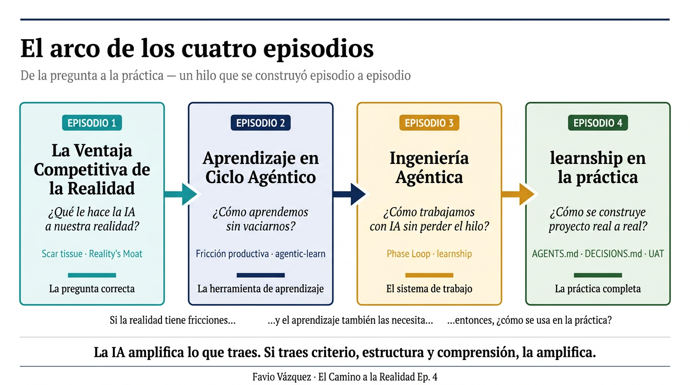

El argumento que atraviesa los cuatro no es "usa más IA" ni "ten cuidado con la IA". Es algo más preciso: **la IA amplifica lo que traes. Si traes criterio, estructura y comprensión, la amplifica. Si no traes nada, no amplifica nada.**

El Episodio 1 dijo que el scar tissue no puede descargarse. El Episodio 4 es sobre el sistema que lo acumula deliberadamente, fase a fase, en un formato que sobrevive el reset del contexto.

`learnship` es el sistema que te ayuda a traer las tres cosas de forma consistente.

---

## Lo que viene: de la física clásica al borde del conocimiento

El roadmap tiene seis fases más antes de que el sitio esté completo.

La **fase 09** cubre la Era 3 — Física Clásica — con doce paradas: Bernoulli, Euler, Coulomb, Volta, Faraday, Carnot, Joule, Maxwell, Doppler, Boltzmann, Hertz, y el experimento de Michelson-Morley. Dinámica de fluidos, electromagnetismo, termodinámica estadística, ondas electromagnéticas. Las cuatro ecuaciones de Maxwell son el punto de inflexión: el momento en que la física del siglo XIX unifica electricidad, magnetismo y luz en un mismo formalismo, y siembra la pregunta que Einstein se haría veinte años después — qué vería alguien que viajara a la velocidad de esa luz.

Las **fases 10 y 11** son la Física Moderna: trece paradas que van de Planck hasta Dirac. La cuantización de la energía, el efecto fotoeléctrico, la dilatación del tiempo, la contracción de longitud, E=mc², el átomo de Rutherford, el modelo de Bohr, la relatividad general, el experimento de la doble rendija, la ecuación de Schrödinger, el principio de incertidumbre, el principio de exclusión de Pauli, la ecuación de Dirac con su predicción de la antimateria. Trece simulaciones que tienen que hacer comprensible la física del siglo XX sin trivializarla. Es la parte más difícil del proyecto.

Las **fases 12 y 13** cubren la Física Contemporánea: desde la fisión nuclear y QED hasta los agujeros negros, la materia oscura, la energía oscura, las ondas gravitacionales y la computación cuántica. La parada 050 es explícitamente sobre lo que no sabemos: la naturaleza de la materia oscura, la constante cosmológica, la reconciliación de la relatividad general con la mecánica cuántica. Un sitio de educación científica que termina con preguntas abiertas me parece más honesto que uno que termina con respuestas definitivas.

La **fase 14** es el pase de integración: verificar que las 50 paradas tienen `isStub: false`, que las ecuaciones KaTeX renderizan correctamente, que los OG meta tags están presentes, que el sitio pasa en Chrome, Firefox, Safari y Edge, que el audit de Lighthouse no sorprende. Y después: deploy del v2.0 en GitHub Pages con el tag correspondiente.

Son las fases que vienen. El Phase Loop las va a ejecutar con la misma estructura que ejecutó las ocho anteriores — discuss, plan, execute, verify — y el `.planning/` va a acumular el registro de cada decisión que se tome en el camino.

---

## El próximo paso

Si llegaste hasta aquí, ya tienes todo lo que necesitas para instalar `learnship` y empezar a usarlo.

```bash
npx learnship
```

Abre tu agente. Escribe `/ls`. Deja que el sistema te guíe desde ahí.

Si tienes un proyecto en marcha que empezaste sin `learnship`, no tienes que empezar desde cero. Hay un workflow específico para eso: `/import-project`, que analiza tu codebase existente, crea los artefactos de `.planning/` retroactivamente, y te pone en el Phase Loop desde donde estás.

Y si quieres ir más despacio, el ciclo completo de tu primer proyecto está documentado en detalle en [la guía de primer proyecto](https://faviovazquez.github.io/learnship/getting-started/first-project/).

---

## La pregunta que me queda para el episodio 5

Mientras construía este episodio, apareció una pregunta que no tenía en mente cuando empecé a escribir.

`learnship` resuelve el problema de la coherencia dentro de un proyecto. Pero hay un problema más grande que ninguna herramienta resuelve por sí sola: la coherencia entre proyectos. Entre roles. Entre equipos.

El Generalista Creativo del episodio 3 opera en la intersección de producto, diseño e ingeniería. `learnship` le da la estructura para construir con calidad dentro de esa intersección. Pero la pregunta de cómo las organizaciones adoptan este tipo de trabajo, cómo los equipos se reorganizan alrededor de él, cómo los roles evolucionan cuando el cuello de botella se mueve de la implementación al criterio: esa pregunta se merece un episodio propio.

Es lo que viene.

---

> *"The model is interchangeable. The harness is the product."*
>
> *"El modelo es intercambiable. El harness es el producto."*

---

## Referencias

**Herramientas**
- [learnship](https://github.com/FavioVazquez/learnship) — Favio Vázquez: plataforma completa de ingeniería agéntica
- [learnship docs](https://faviovazquez.github.io/learnship/) — Documentación oficial
- [agentic-learn](https://github.com/FavioVazquez/agentic-learn) — Favio Vázquez: skill de aprendizaje activo (Episodio 2)
- [impeccable](https://github.com/pbakaus/impeccable) — pbakaus: design system de calidad para UI con IA
- [get-shit-done (GSD)](https://github.com/davila7/get-shit-done) — davila7: base del workflow engine de learnship

**Investigación citada**
- Scaffolding benchmark: mismo modelo, 42% vs. 78% con scaffolds diferentes — investigación en arquitecturas agénticas, 2024
- Cursor lazy context loading: reducción del 47% en uso de tokens — Cursor engineering blog
- Vercel tool reduction: 80% menos herramientas → tasks completadas — Vercel engineering

**Episodios anteriores — The Road to Reality**
- [Episodio 1: La Ventaja Competitiva de la Realidad](https://www.linkedin.com/pulse/la-ventaja-competitiva-de-realidad-favio-v%C3%A1zquez/) — Favio Vázquez
- [Episodio 2: Aprendizaje en Ciclo Agéntico](https://www.linkedin.com/pulse/aprendizaje-en-ciclo-ag%C3%A9ntico-favio-v%C3%A1zquez/) — Favio Vázquez
- [Episodio 3: Ingeniería Agéntica — La Era del Generalista Creativo](https://www.linkedin.com/pulse/ingenier%C3%ADa-ag%C3%A9ntica-la-era-del-generalista-creativo-favio-v%C3%A1zquez/) — Favio Vázquez
