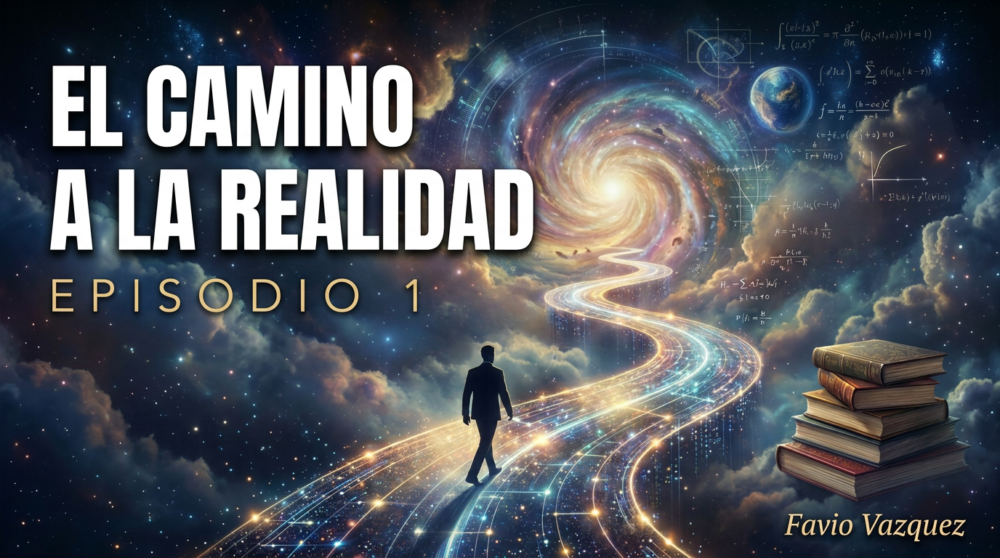
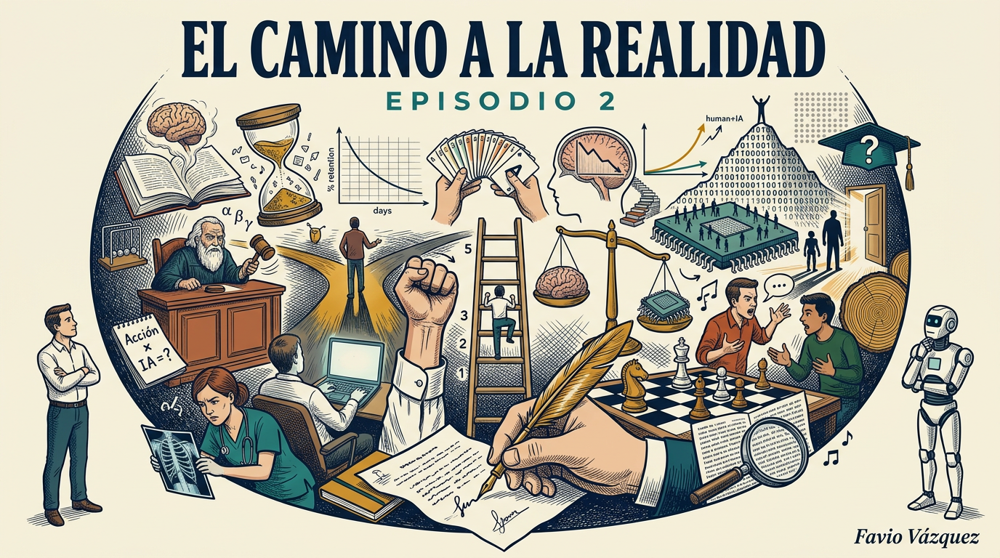
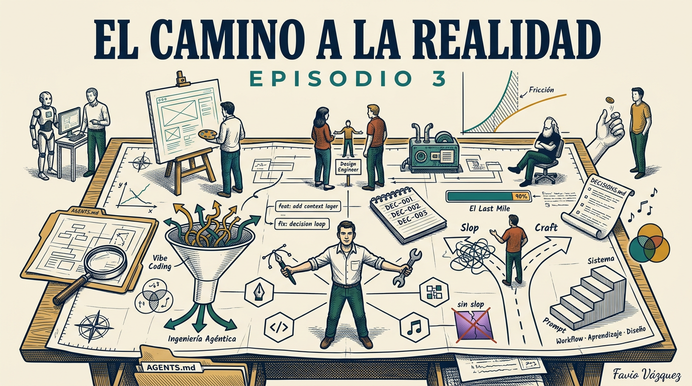

# Road to Reality

A research series by [Favio Vázquez](https://github.com/FavioVazquez) exploring the intersection of AI, learning, and the nature of reality. Each episode is a deep investigation that produces both long-form writing and working software.

The name comes from Roger Penrose's book *The Road to Reality* — nearly 1,500 pages tracing the mathematical foundations of physics from ancient Greece to quantum gravity. I found it as a student in a bookstore in Maracaibo, Venezuela, and it took me most of my adult life to get through. The spirit of this series is the same: to understand how reality works, built piece by piece.

**Live site:** [roadtoreality.dev](https://roadtoreality.dev)

---

## Episodes

### Episodio 1 — The Real State of AI Adoption

Most conversations about AI assume everyone is using it deeply. The numbers say otherwise.

This episode investigated who actually uses AI, how, and what that distribution reveals about the gap between public narrative and ground-level reality. The finding: **87.8% of humanity has never used AI in any meaningful way**. Of those who have, the vast majority use it passively — one prompt, one answer, move on. The population using AI as a genuine cognitive tool is a fraction of a percent.

The episode produced a long-form essay (in Spanish and English), data visualizations reconstructed from ITU and OpenAI figures, and a LinkedIn/X thread.

---

### Episodio 2 — Learning in the Age of Instant Output

When AI can produce output almost instantly, the bottleneck shifts. The question is no longer "how do I produce more?" It's "how do I actually learn anything when the machine can just do it for me?"

Laura Summers of Pydantic described the problem precisely: *"LLM-assisted programming automated much of the work that generated dopamine hits and replaced it with the cognitive load of review and supervision. The satisfying part shrank. The exhausting part grew."* This is not a programming problem. It's the pattern that emerges in any domain where AI takes the visible work and leaves the invisible.

The episode produced a practical answer: `agentic-learn`, an open-source skill that turns an AI agent into an active learning partner instead of an answer machine. It implements spaced repetition, productive struggle, Socratic dialogue, and metacognitive reflection — all inside your IDE.

The skill is live at [github.com/FavioVazquez/agentic-learn](https://github.com/FavioVazquez/agentic-learn).

---

### Episodio 3 — Agentic Engineering: The Era of the Creative Generalist

Building on the learning framework from Episodio 2, this episode tackled a larger question: how do you *build* with AI at scale without losing coherence, quality, or understanding?

The investigation covered Martec's Law (technology changes exponentially, organizations change logarithmically), the collapse of the specialist/generalist divide, and what it means to be a "creative generalist" — someone who can move across domains because AI handles the depth while the human handles the direction. Research showed that the same base model performs at 42% vs. 78% depending solely on the harness surrounding it — the scaffold matters more than the model.

The episode introduced `learnship`: an agentic workflow system that structures AI-assisted work into explicit phases with persistent memory, specialist agents, and mandatory verification. It became the foundation for Episodio 4.

---

### Episodio 4 — How Physics Works

The culmination of the methodology built across episodes 2 and 3: a full software project planned and executed using the `learnship` agentic workflow system, built in public.

The project is a static interactive website walking through 2,500 years of physics history via 50 stops — from Thales (~600 BCE) to the contemporary frontiers. Each stop pairs a narrative essay with a Canvas-based interactive simulation. 25 of 50 simulations are complete, covering Ancient Physics, the Scientific Revolution, and Classical Physics (through 1887).

**Live site:** [roadtoreality.dev/HowPhysicsWorks](https://roadtoreality.dev/HowPhysicsWorks/) — built with zero backend, zero build step, pure HTML/CSS/JS.

See [`HowPhysicsWorks/`](./HowPhysicsWorks/) for all site code and [`HowPhysicsWorks/README.md`](./HowPhysicsWorks/README.md) for technical documentation.

The full planning process is documented in [`.planning/`](./.planning/) — every phase, decision, requirement, and UAT result kept as first-class artifacts. 9 phases complete, v2.0 milestone in progress.

---

## What Learnship Is

Learnship is the agentic workflow system developed through this series. It structures AI-assisted work into explicit phases: discovery, planning, execution, and verification. Every decision has a record. Every phase has a definition of done. Nothing ships without a UAT report.

It's what makes long-horizon AI-assisted projects stay coherent across many sessions and many moving parts. The `.planning/` directory in this repo is a live example of it in action.

---

## About

Built by [Favio Vázquez](https://github.com/FavioVazquez) — data scientist, researcher, and writer. Background in theoretical physics and computer engineering. The Road to Reality is an ongoing investigation into how intelligence (human and artificial) actually works, and what it means to build things that matter with it.
